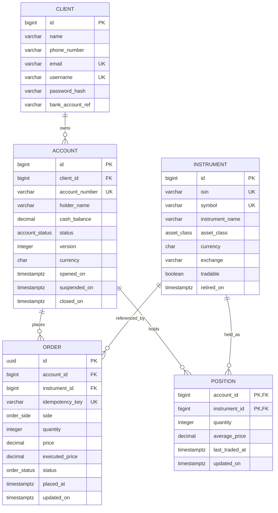

# Sprint 3 ER diagram

This ERD intentionally follows the team's proposed model while keeping the
transactional schema normalized.

## How this maps to the team's screenshot

- **Client** is the customer identity/credential owner. Passwords are stored as `password_hash`, never as a plaintext `password`.
- **Account** belongs to exactly one Client; a Client may own multiple Accounts.
- **Order** belongs to one Account and one Instrument.
- **Position** is the current holding for one Account + Instrument pair, so that pair is its composite primary key.
- **Instrument** is identified internally by `id`; `isin` and `symbol` are business/reference identifiers.

### Deliberate 3NF correction

The screenshot repeats `productType` on Order and Position. The database does **not** store that duplicate value. Product/asset class is a property of the Instrument, so Order and Position reach it through `instrument_id`. This avoids update anomalies and is the cleaner 3NF model.

### Trade and PriceHistory in the screenshot

They are useful concepts, but Sprint 3's brief explicitly makes historical trade data a **design-only deliverable** rather than a built table. Therefore this Sprint 3 database does not create `trade` or `price_history` tables. Their retention grain, population, incremental extraction and growth strategy are documented in `DESIGN.md`. They can be added in a later migration when the relevant sprint requires them.
